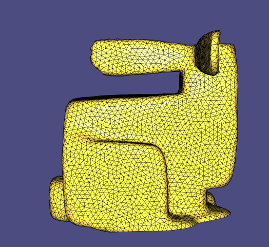
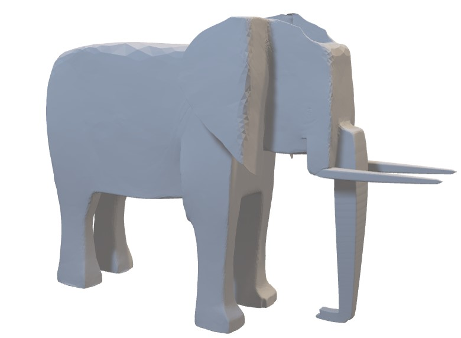
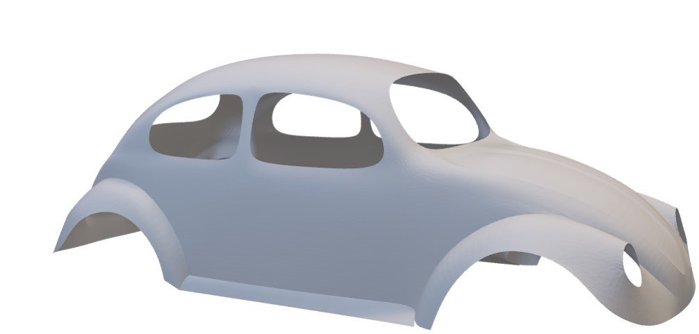
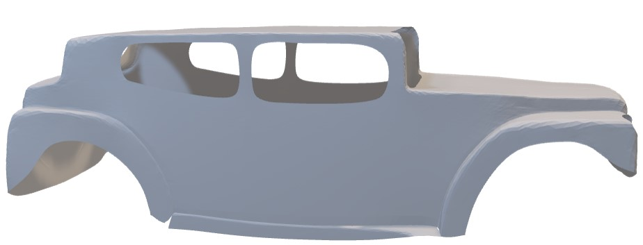

# Libigl-style paper implementation - Cubic Stylization
Yunfan Zhang (UTORid:zhan3697)

Mengze Liu (UTORid: liumengz)


## Introduction
Cubic Stylization is a 3D stylization algorithm presented by Hsueh-Ti Derek Liu and Alec Jacobson in [Cubic Stylization Paper](https://www.dgp.toronto.edu/projects/cubic-stylization/cubicStyle_high.pdf)
The main purpose of this algorithm is to turn an input 3D model into a cubic style model


## Our Implementation
The core of this cubic stylization algorithm is to minimize an energy function. Therefore, we need to first initialize values, which is implemented in `cubic_style_precomputation.cpp`, and then perform updates in each iteration, which is implemented in `cubic_style_single_iteration.cpp` and `local_step.cpp`. We divided a single iteration into two parts because local step has many intermediate values, and it will be clearer if local step is in a single file.
The algorithm was very slow at the beginning, even through the stopping criteria (relative displacement) was implemented. After reading the book **"Distributed Optimization and Statistical Learning via the Alternating Direction Method of Multipliers"** in **page 19**, we found a stopping criteria for local step, which made our algorithm faster

## Code Structure
There are three `.cpp` files and four header file which implement the cubic stylization algorithm: 
`cubic_style_precomputation.cpp`,  
`cubic_style_single_iteration.cpp`, 
`local_step.cpp`,
The extra header file `cubic_style_data.h`defines a struct to store intermediate values that need to be updated in each iteration. We also have a `main.cpp` file to visualize the outputs.
We use the similar layout and structure as in [Geometry Processing – Introduction](https://github.com/alecjacobson/geometry-processing-introduction)
```
    README.md
    CMakeLists.txt
    main.cpp
    src/
      cubic_style_data.h
      cubic_style_precomputation.cpp
      cubic_style_precomputation.h
      cubic_style_single_iteration.cpp
      cubic_style_single_iteration.h
      local_step.cpp
      local_step.h
    data/
    ...
```


## Language and Libraries
The algorithm is implemented using C++ in the syle of [libigl](https://libigl.github.io/) and using [Eigen](http://eigen.tuxfamily.org/)

## How to run our code
we use the similar procedure as in [Geometry Processing – Introduction](https://github.com/alecjacobson/geometry-processing-introduction)
```sh
$ mkdir build
$ cd build
$ cmake..
$ make
$ ./CubicStylization {model.obj}
```
**Input model:** examples of input models are stored in `data` folder. Enter the name of the `.obj` file as parameter.
To add a new model, store it under `data` folder, or change the input path at `main.cpp`

**Output**: Output cubic style models will be shown using `libigl viewer`, and output files will also be stored in the project directory as `output{filename}.obj`


## Examples 
input elephant:


output:




input beetle



output



